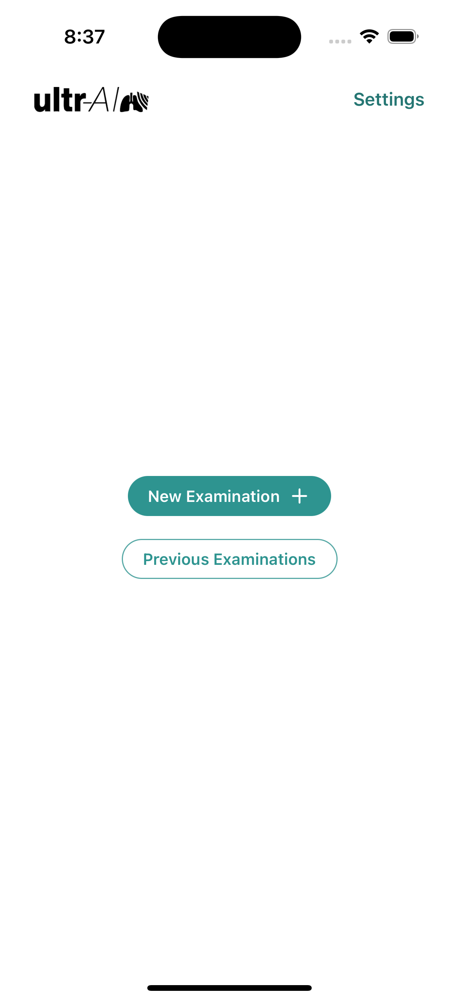

# LUS4TB Prototype


This repository contains a prototype for the LUS4TB app—a React Native application built with [Expo](https://expo.dev") in the course of my master thesis. The app offers features to help healthcare workers in low- and middle-income countries (LMICs) assess the Tuberculosis (TB) risk of patients using the Butterfly Network point-of-care ultrasound.


### Overview

LUS4TB aims to support healthcare workers by providing a tool to mainly:

- **Enter Patient Information:** Quickly input and manage patient details.
- **Record Images (or Upload):** Capture ultrasound images for specific anatomical key sites.
- **Retrieve Predicted TB Risk:** Automatically generate TB risk predictions based on ultrasound imaging.

The prototype was designed following a user-centered approach.


## Installation

### Prerequisites

- **Node.js:** Download [here](https://nodejs.org/en).
- **Expo:** Install  with `npm i expo`

### Steps

1. Clone the repository

2. Install dependencies

   ```bash
   npm install
   ```

3. Start the app

   ```bash
    npx expo start
   ```

In the output, you'll find options to open the app in a

- [Android emulator](https://docs.expo.dev/workflow/android-studio-emulator/)
- [iOS simulator](https://docs.expo.dev/workflow/ios-simulator/)
- [Expo Go](https://expo.dev/go), a sandbox for trying out the app directly on your phone


## Main User and Data Flow

1. 	Home Screen:
The user initiates a new analysis, which creates an empty Examination object stored in global state.

2.	New Analysis Screen:
Patient data is collected via a form and saved in the global Examination context.

3.	Image Acquisition:
The user chooses a method:
	•	Capture: Images are captured using a mock ultrasound tool.
	•	Upload: Images are selected from the device’s gallery.
The selected images are appended to the Examination object.

4.	Analysis:
The app simulates a TB risk analysis by generating random predictions, calculates overall risk, and updates the Examination object accordingly.
The prototype does not include the AI models (Ultr-AI and Ultr-AI signs) at the time of submitting the thesis.

5.	Result & Report Export:
A report is generated (and can be exported as a PDF) based on the Examination data. The report includes patient info, symptoms, analysis results, and recommended actions.

6.	Saving & Clearing Data:
The final Examination data is saved (e.g., in AsyncStorage) and the global context is cleared to prepare for the next analysis.


### Configuration

All Tuberculosis risk thresholds, recommended actions, and the summary template are defined in src/config/tbRiskConfig.ts:
   
## Directory Structure

```bash
src/
├── app/ 			# Application screens (Home, NewAnalysis, Scan, etc.)
│   ├── index.tsx 	# Home screen of the application
│   ├── _layout.tsx # Main entry point for the application (root layout)
│   └── ...
├── assets/ 		# Static assets: images, fonts, etc.
├── components/ 	# Components grouped by screen or type
│   ├── ui/  		# Reusable Gluestack UI components (Button, AlertDialog, Spinner, ect.)
│   └── ...
├── config/   		# Configuration files (tbRiskConfig.ts, ect.)
├── context/ 		# Global state management (ExaminationContext, SettingsContext, ect.)
├── models/ 		# Data models and enums (Examination, Enums, ect.)
├── services/ 		# Data persistence (examinationService, imageService, ect.)
└── ...
```

## Screenshots of the App
<table style="border-collapse: collapse; width: 100%;">
  <tr>
    <td align="center" style="padding: 10px;">
      <br>
      <strong>Home Screen</strong>
    </td>
    <td align="center" style="padding: 10px;">
      <br>
      <strong>New Analysis</strong>
    </td>
    <td align="center" style="padding: 10px;">
      <br>
      <strong>Image Option</strong>
    </td>
    <td align="center" style="padding: 10px;">
      <br>
      <strong>Image Upload</strong>
    </td>
  </tr>
  <tr>
    <td align="center" style="padding: 10px;">
      <br>
      <strong>Scan Helper</strong>
    </td>
    <td align="center" style="padding: 10px;">
      <br>
      <strong>Scan Protocol</strong>
    </td>
    <td align="center" style="padding: 10px;">
      <br>
      <strong>Result</strong>
    </td>
    <td align="center" style="padding: 10px;">
      <br>
      <strong>Settings</strong>
    </td>
  </tr>
</table>

---

### Disclaimer

Due to time constraints, the Ultr-AI models were not integrated into the prototype during the course of the master’s thesis. Instead, a mock implementation was used as a placeholder. Additionally, the Butterfly Network SDK was not incorporated into the research study due to pricing limitations, and a mock version was implemented in the prototype as an alternative.

### Future Work

As part of the research done to develop a user-centered application for TB triage, some key features could be implemented in the future, including:
- Compute a pre-test probability of the TB risk of the patient based on the forms data, to refine the AI-based predicted TB risk 
- User management 
- Introduction flow to use when training staff on how to use the app

### Acknowledgements

- Built with [React Native](https://reactnative.dev), [Expo](https://expo.dev) and [Gluestack](https://gluestack.io).
- Icons provided by Ionicons, Expo, Gluestack.
- Special thanks to the Butterfly Network for inspiring point-of-care ultrasound innovations and to the global healthcare community for their continued work in LMICs!

